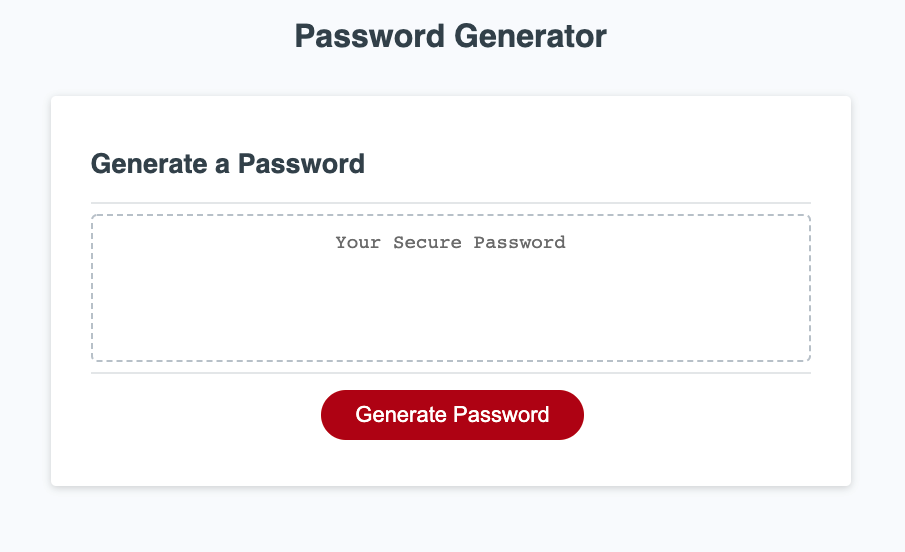

# Friendly Parakeet - Password Generator

## Dev Notes
Refactor consisted of adding new functions to handle steps in generating a new password and then calling these functions in order withing the existing legacy code's generatePassword() function.

### New Functions Added
*   promptSequence();       Responsible for collecting employee's chosen password criteria
*   combineWantedChars();   Combines all chosen character types into a single property
*   genRandomString();      Generate random characters, forming a string at desired length

## Link
https://mehranmatin.github.io/friendly-parakeet/

## Password Generator Screenshot

## Refactored By
Mehran M.

### ©️2022 Mehran M.
